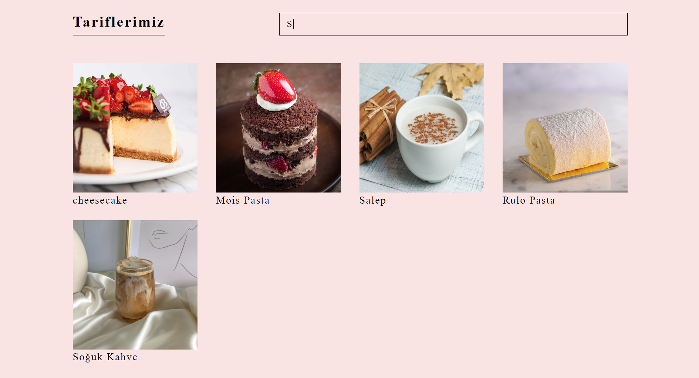
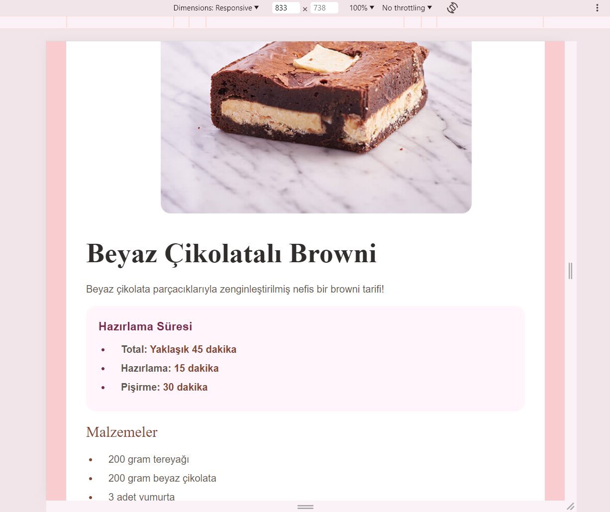

## Proje Kurulumu ve Çalıştırılması

## 1. Giriş
Bu proje ile amacım, mutfakta geçirilen zamanı daha keyifli hale getirmek ve her seviyeden 
kullanıcının rahatça kullanabileceği bir tarif platformu sunmaktır. 
Bu projede, kullanıcılarımızın çeşitli tatlı, tuzlu, içecek ve sos tariflerine kolayca ulaşabilmesini 
sağlayan bir web sitesi oluşturduk. Sitemiz, tarifleri kategorilere ayırarak kullanıcının aradığını 
kolayca bulmasını sağlıyor. İlk olarak, sayfa yüklenirken kullanıcıya görsel bir bildirim sunan yükleme 
ekranı (preloader) ile karşılanırsınız. Navigasyon barımız, kullanıcının site içinde kolayca gezinmesini 
sağlamak amacıyla logo, arama çubuğu ve kullanıcı hesabı butonunu içerir. Logo üzerinden ana 
sayfaya dönebilir, arama çubuğu ile tarif arayabilir ve hesap butonunu kullanarak giriş yapabilir veya 
üye olabilirsiniz.

## 2. Gereksinimler
Projenin doğru bir şekilde çalışabilmesi için aşağıdaki gereksinimlerin karşılanması gerekmektedir:
- Node.js ve npm yüklü olmalıdır.
- MongoDB yerel olarak veya bir servis üzerinden çalıştırılmalıdır.

## 3. Kurulum ve Çalıştırma

### 3.1. Bağımlılıkları Yükleme
Projenin kök dizininde terminali açarak aşağıdaki komutu çalıştırın:
```bash
npm install
```

### 3.2. Veritabanı Ayarları
- MongoDB'yi başlatın.
- `.env` dosyasında aşağıdaki gibi veritabanı bağlantı URL'sini belirtin:
  ```
  MONGO_URI=mongodb://localhost:27017/tarifler
  ```

### 3.3. Backend Sunucusunu Başlatma
Terminalde aşağıdaki komutu çalıştırın:
```bash
npm start
```
veya
```bash
node server.js
```

### 3.4. Frontend'i Çalıştırma (Eğer Ayrıysa)
Eğer proje bir frontend içeriyorsa, ilgili dizine giderek aşağıdaki komutları çalıştırın:
```bash
npm install
npm run dev
```
veya
```bash
npm start
```

### 3.5. Projeyi Tarayıcı Üzerinde Açma
Sunucu çalıştıktan sonra aşağıdaki URL'yi tarayıcıya girerek projeyi görüntüleyebilirsiniz:
```
http://localhost:3000
```

## 4. Sonuç
Bu adımlar takip edilerek proje başarıyla kurulabilir ve çalıştırılabilir. Olası hata ve sorunlar için proje dokümantasyonunu veya geliştirici notlarını kontrol edebilirsiniz. 


## 🖼️ Uygulama Görselleri

### Ana Sayfa


### Arama Sayfası


### Tarif Detay

